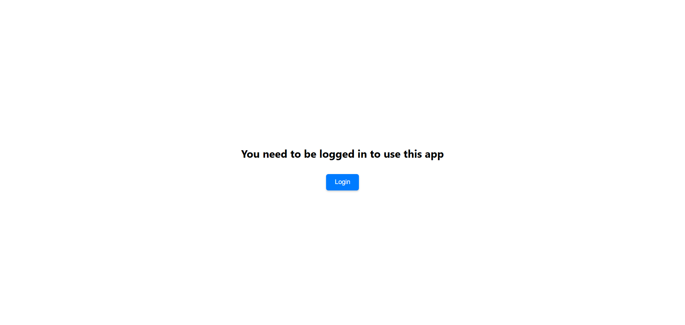
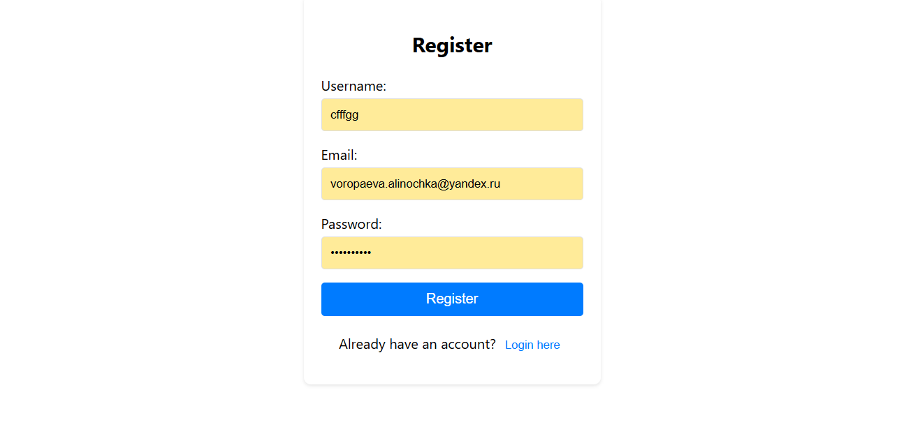
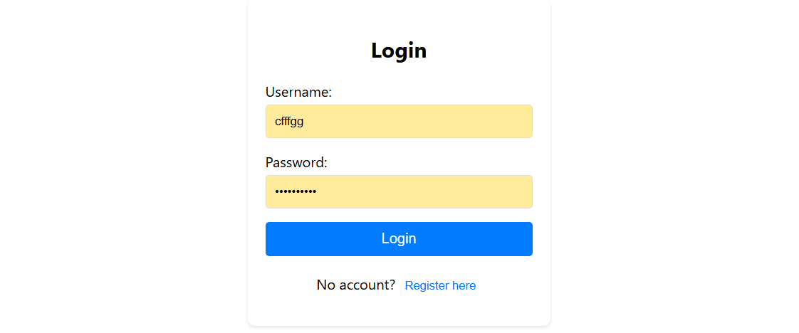

# Finance Tracker

Finance Tracker je aplikace pro sledování vlastních financí, konkrétně peněžních výdajů a příjmů. Hlavním účelem aplikace je usnadnit sledování vlastních financí.

GUI prototyp aplikace je [na webu Figma](https://www.figma.com/design/b6HMMEiGKAHWUgCDRkyFf3/Finance-Tracker?node-id=0-1&t=kgO3v3iZLP6BzUfj-1).

# 📌 Použité technologie

**- Java a Spring Boot**

**- PostgreSQL**

**- REST API**

**- API Gateway**

**- Eureka**

**- Docker**

**- React**

# 📌 Aplikace se skladá ze tří microservis:

**1. User Microservice**

- Spravuje registraci, autentizaci a autorizaci uživatelů.
- Uchovává data o uživatelích, jako je uživatelské jméno, heslo a další informace.


**2. Finance Microservice**

- Zodpovídá za správu finančních cílů a dluhů.
- Poskytuje API pro práci s finančními cíli a dluhy.


**3. Transaction Microservice**

- Spravuje finanční transakce, včetně příjmů a výdajů.
- Poskytuje API pro přidávání, úpravu, mazání a zobrazování transakcí.

# 📌 Application Features
- **🔐 Login/Registration:** Secure authentication system allowing users to sign up and log in.




- **💳 Debts:** Track and manage your outstanding debts, including creditors, amounts, and interest rates.

- **🎯 Goals:** Set financial goals and monitor progress toward achieving them.

- **💰 Expenses/Incomes:** Record and categorize your transactions to keep track of your financial flow.

- **📈 Statistics:** View financial insights through charts and summaries.

# 📌 Spuštění:

1. Naklonujte repositář git clone https://github.com/voropali1/finance_tracker.git

2. Přepněte do adresáře frontend.

3. Nainstalujte závislosti:

```
npm install
npm install recharts
```

Přepněte se do hlávního adresáře.

4. Build:

`docker-compose build`

5. Spuštění v pozadí:

`docker-compose up -d`

6. Zastavení a odstranění kontejnerů:

`docker-compose down`
