# Finance Tracker

Finance Tracker is an application for tracking personal finances, specifically expenses and income. The main purpose of the app is to make it easier to track your finances.

The GUI prototype of the application can be found [on Figma](https://www.figma.com/design/b6HMMEiGKAHWUgCDRkyFf3/Finance-Tracker?node-id=0-1&t=kgO3v3iZLP6BzUfj-1).

# 📌 Technologies Used

**- Java a Spring Boot**

**- PostgreSQL**

**- REST API**

**- API Gateway**

**- Eureka**

**- Docker**

**- React**

# 📌 The application consists of three microservices:

**1. User Microservice**

- Manages user registration, authentication, and authorization.
- Stores user data such as username, password, and other information.


**2. Finance Microservice**

- Manages financial goals and debts.
- Provides an API for working with financial goals and debts.


**3. Transaction Microservice**

- Manages financial transactions, including income and expenses.
- Provides an API for adding, editing, deleting, and displaying transactions.

# 📌 Application Features
##  **🔐 Login/Registration:** Secure authentication system allowing users to sign up and log in.

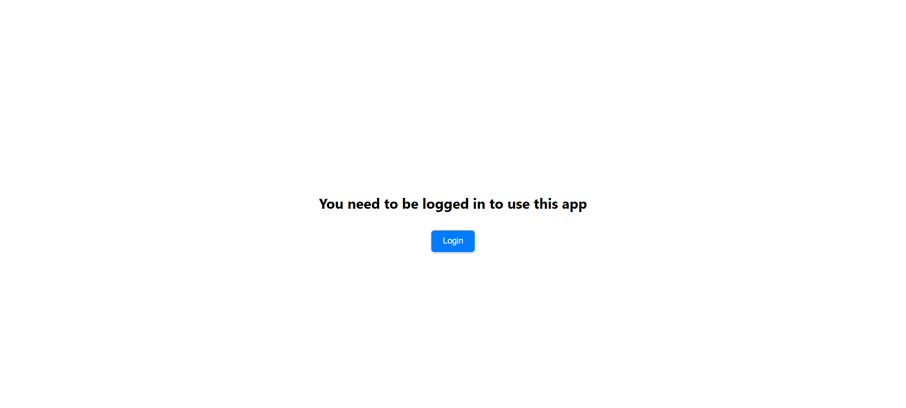
#

#


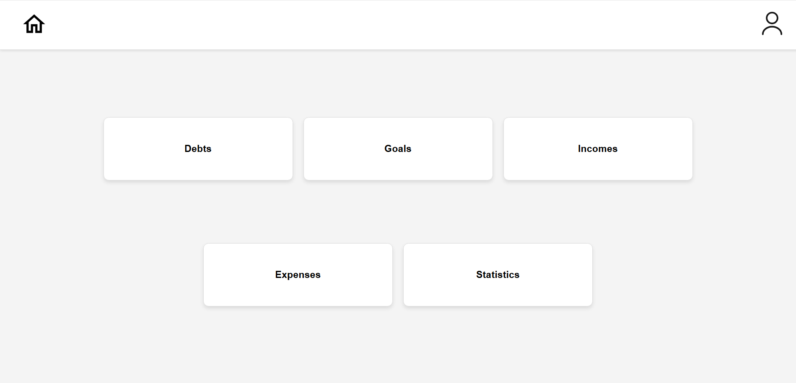
#
##  **💳 Debts:** Track and manage your outstanding debts, including creditors, amounts, and interest rates.

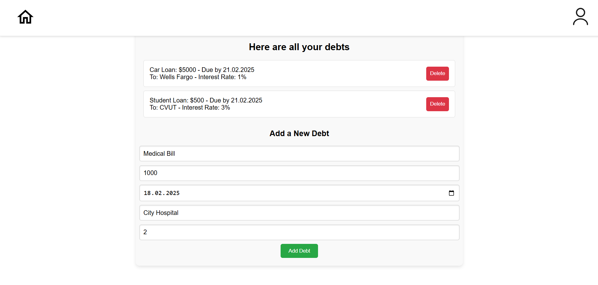
#

##  **🎯 Goals:** Set financial goals and monitor progress toward achieving them.

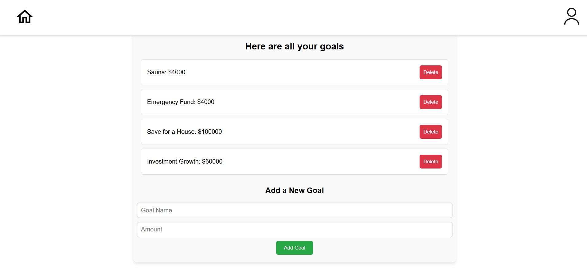
#
##  **💰 Expenses/Incomes:** Record and categorize your transactions to keep track of your financial flow.

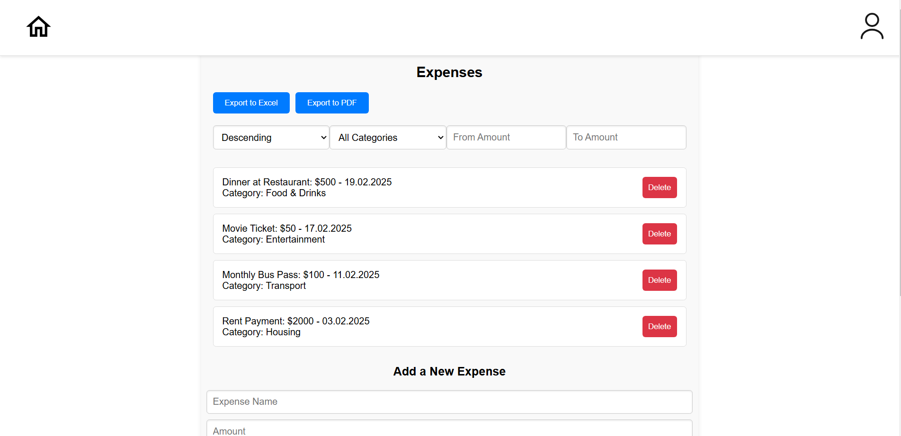
#

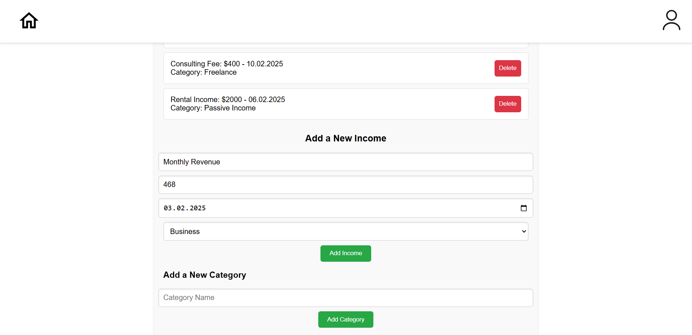
#

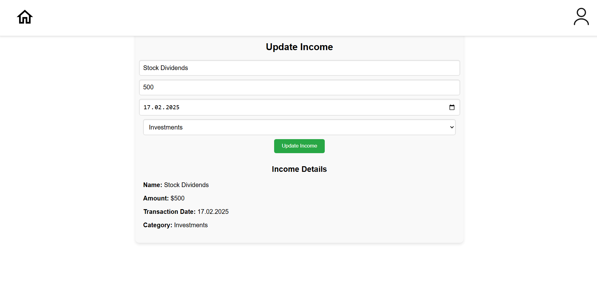
#
### • There is an option to convert to PDF and Excel.
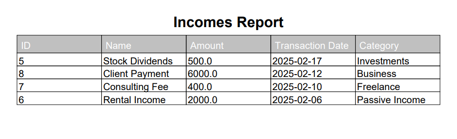
#
<p align="center">
  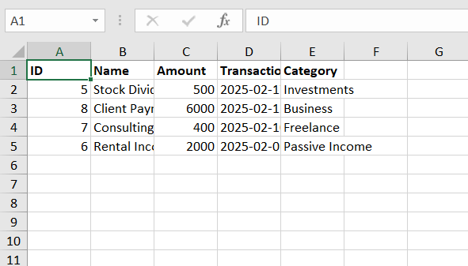
</p>

#

##  **📈 Statistics:** View financial insights through charts and summaries.

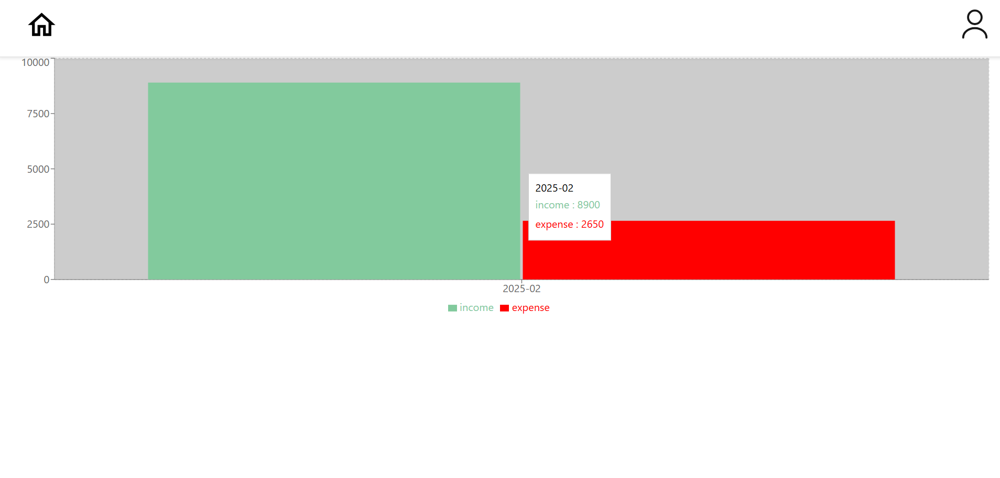
# Use Case Diagram
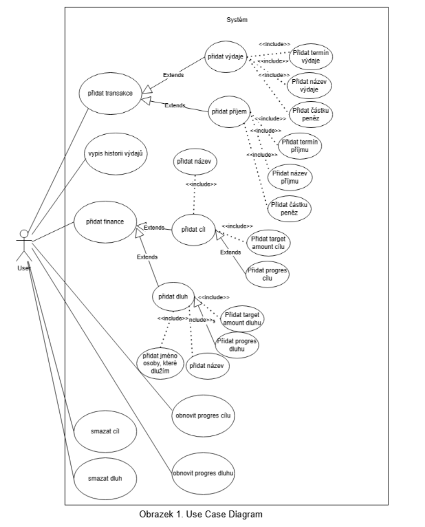

# Diagram component
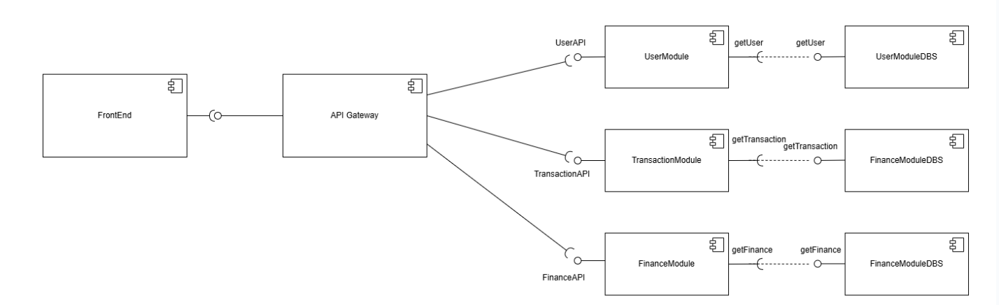
# 📌  Running the application:

1. Clone the repository git clone https://github.com/voropali1/finance_tracker.git

2. Navigate to the frontend directory.

3. Install dependencies:

```
npm install
npm install recharts
```

Go back to the main directory.

4. Build the application:

`docker-compose build`

5. Run in the background:

`docker-compose up -d`

6. Stop and remove containers:

`docker-compose down`
